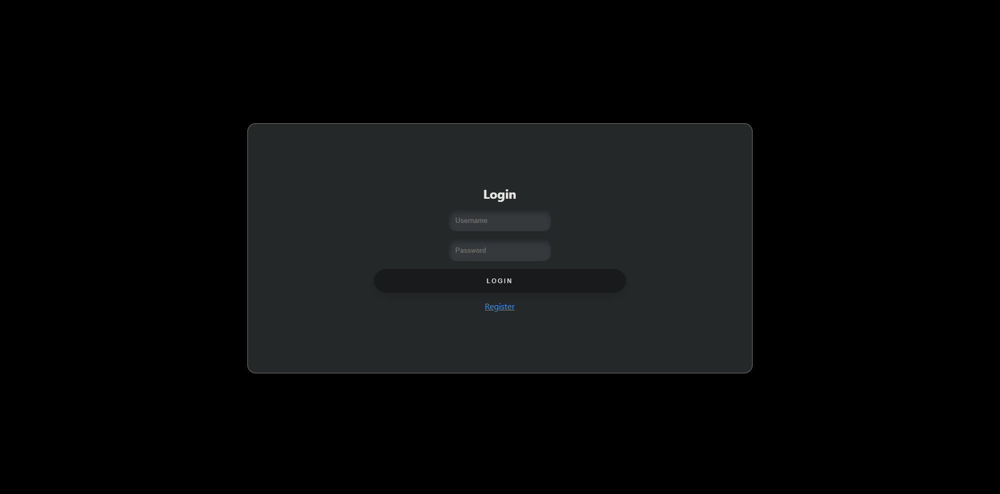
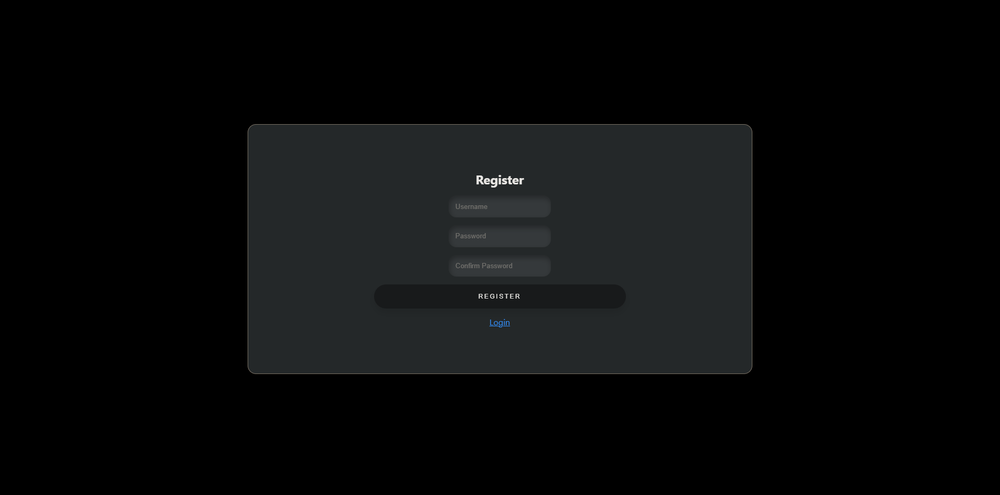
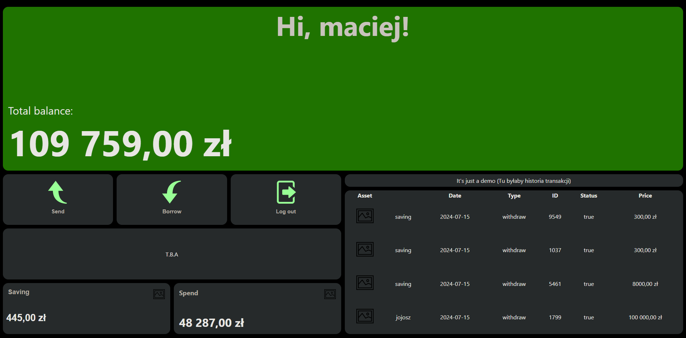

# Banking App

Banking App is a banking application built using Node.js, Express, MongoDB, and Vue.js. It allows creating bank accounts and updating account balances.

## Table of Contents
1. [Screenshots](#screenshots)
2. [Tech Stack](#tech-stack)
3. [Requirements](#requirements)
4. [Installation](#installation)
5. [Running the Application](#running-the-application)
6. [Project Structure](#project-structure)
7. [API](#api)
8. [Frontend](#frontend)
9. [Examples](#examples)

## Screenshots





   
## Tech Stack

**Client:** Vue.js, Vite.js


<br />
<br />

**Server:** Node.js, Express, Axios, MongoDB


<br />
<br />

## Requirements

- Node.js
- MongoDB
- Vue CLI

## Installation

### Backend
1. Install [Node.js](https://nodejs.org/en/download) (You can check it with this command)
  ```bash
    node --version
  ```
2. Install [MongoDB](https://www.mongodb.com/try/download/community) or [MongoDB Compass](https://www.mongodb.com/try/download/compass)
3. Clone the repository:
    ```sh
    git clone https://github.com/ItsMaciek/BankApplication
    ```
4. Navigate to the `server` directory:
    ```sh
    cd BankApplication/server
    ```
5. Install dependencies:
    ```sh
    npm install
    ```

### Frontend

1. Navigate to the `bankgui` directory:
    ```sh
    cd ../bankgui
    ```
2. Install dependencies:
    ```sh
    npm install
    ```

## Running the Application

### Backend

1. Ensure MongoDB is running.
2. Navigate to the `server` directory:
    ```sh
    cd BankApplication/server
    ```
3. Start the server:
    ```sh
    node app.js
    ```
   The server will listen on port 5000.

### Frontend
1. Navigate to the `bankgui` directory:
    ```sh
    cd ../bankgui
    ```
2. Start the Vue application:
    ```sh
    npm run dev
    ```
   The application will be available at `http://localhost:5173`.
